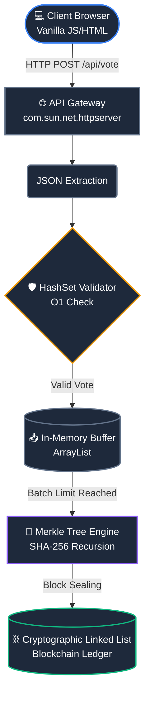

# Decentralized Election Ledger

An in-memory blockchain application leveraging SHA-256 and Merkle Trees to secure voting data against internal database tampering.

## Prerequisites
* Java 11 or higher
* Any standard web browser (Chrome/Edge)

## System Architecture

